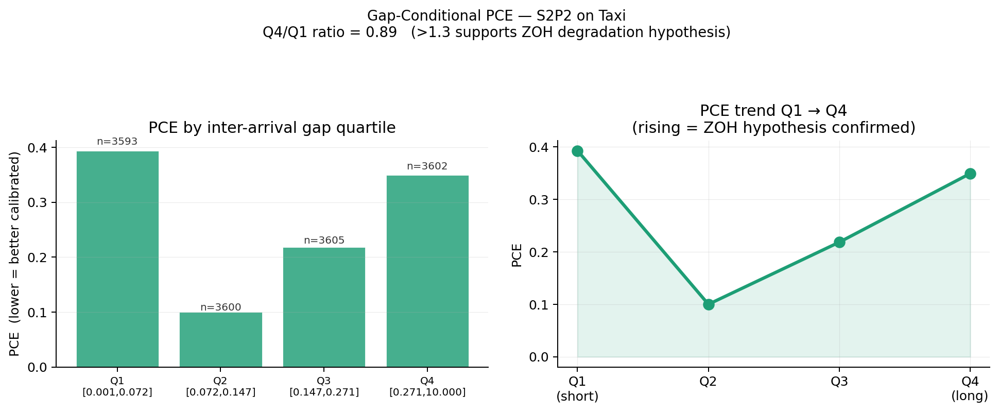

# Gap-Conditional Calibration Analysis of S2P2

Extending the calibration evaluation of [Chang et al., NeurIPS 2025].

S2P2 reports a single aggregate Probabilistic Calibration Error (PCE) per dataset. 
This analysis introduces **Gap-Conditional PCE (GC-PCE)** — PCE computed separately 
within each inter-arrival gap quartile — and applies it to S2P2 on the Taxi benchmark.



The aggregate metric reports one number. GC-PCE reveals a U-shaped calibration profile: 
worst at rapid-succession events (Q1: PCE = 0.393) and long gaps (Q4: PCE = 0.349), 
with best calibration at medium gaps (Q2: PCE = 0.100) — a 3.9× spread invisible to 
the standard metric. 

## Setup

```bash
git clone https://github.com/akashhebbar/s2p2-calibration-analysis
cd s2p2-calibration-analysis
pip install -r requirements.txt

# Clone EasyTPP (required dependency — not included here)
git clone https://github.com/ant-research/EasyTemporalPointProcess.git
pip install -e EasyTemporalPointProcess
```

## Run

Place your trained S2P2 checkpoint at the path defined in `gc_pce_taxi.py`, then:

```bash
python gc_pce_taxi.py
```

Results are saved to `results/`. To re-plot from a saved run without rerunning the model:

```bash
python gc_pce_taxi.py --plot-only --skip-synthetic
```

## Reference

```
@inproceedings{chang2025s2p2,
  title     = {Deep Continuous-Time State-Space Models for Marked Event Sequences},
  author    = {Chang, Yuxin and Boyd, Alex and Xiao, Cao and others},
  booktitle = {NeurIPS},
  year      = {2025}
}
```
